# OpenRec

**An end-to-end open-source recommendation platform that grows from a single machine to a
distributed data stack without changing your application API.**

OpenRec connects data ingestion, streaming and batch processing, recall generation, configurable
online serving, model training, experimentation, observability, and operations in one system. Use
the lightweight standalone distribution for development and small-to-medium workloads, or enable
the cluster distribution for Kafka, Spark, Airflow, versioned recall indexes, and model lifecycle
management.

[Get started](https://github.com/open-rec/example#quick-start) ·
[Standalone guide](https://github.com/open-rec/example/tree/master/example_standalone) ·
[Cluster guide](https://github.com/open-rec/example/tree/master/example_cluster) ·
[Architecture](https://github.com/open-rec/example/blob/master/docs/architecture.md) ·
[Contributing](https://github.com/open-rec/.github/blob/master/CONTRIBUTING.md) ·
[Security](https://github.com/open-rec/.github/blob/master/SECURITY.md)

## Why OpenRec

- **One API, two deployment modes.** Start locally, then move ingestion, features, recall, and
  ranking onto distributed infrastructure without replacing the recommendation contract.
- **Complete recommendation lifecycle.** Ingest users, items, and events; compute recall tables;
  train and publish models; serve recommendations; measure and operate the system.
- **Configurable online DAG.** Compose recall, filtering, ranking, combination, and operation nodes,
  then publish or roll back graph snapshots through the control plane.
- **Safe artifact lifecycle.** Recall indexes and rank models are immutable, validated, activated
  atomically, retained by policy, and explicitly rollbackable.
- **Observable by design.** Request metrics, dependency health, business analytics, entity
  diagnostics, Airflow state, and Grafana dashboards are available from the operations console.
- **Replaceable components.** Storage, recall algorithms, operation rules, processing engines, and
  clients are separated into focused repositories with documented contracts.

## Quick start

Clone the distribution repository together with its sibling components, then start the smallest
complete recommendation chain:

```shell
git clone https://github.com/open-rec/example.git
cd example
./scripts/checkout-components.sh
./example_standalone/start.sh
```

After the acceptance check succeeds, open the Web Demo at `http://127.0.0.1:12345` and the OpenRec
Console at `http://127.0.0.1:8095`.

> The distribution is under active development. Review the deployment guide and replace all sample
> credentials before exposing any service outside a trusted development network.

## See OpenRec in action

The Web Demo exercises the same recommendation API used by applications and SDKs. Switch users,
scenes, and experiments; inspect recall and rank scores; then send exposure, click, collect,
purchase, or negative-feedback events to see the next recommendation respond to behavior.

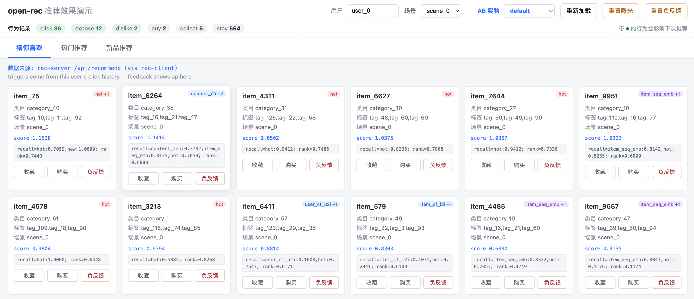

The OpenRec Console brings the serving and data planes into one control surface. Operators can
inspect and publish recommendation graphs, govern immutable recall and model versions, configure
offline workflows, and follow production traffic without assembling separate administration
tools.

### Serving Graph and experiments

Visually inspect the live recommendation DAG, tune node configuration, and maintain experiment
variants with an explicit default fallback. The graph view makes recall fan-out, filtering,
combination, ranking, operation rules, and collection paths visible together.

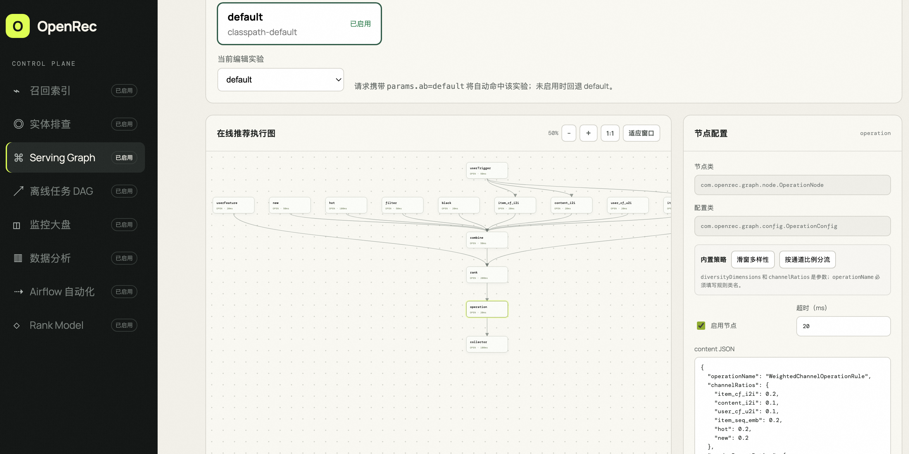

### Artifact and workflow lifecycle

| Recall index operations | Offline recommendation workflow |
|---|---|
| 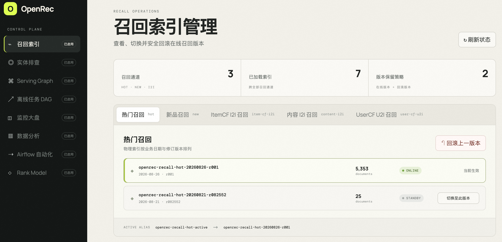 | 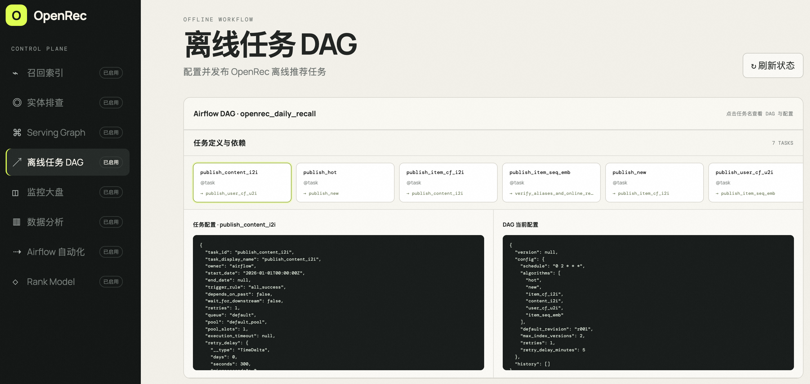 |
| Review hot, new, and i2i index versions, atomically switch the active alias, retain rollback candidates, and restore the previous version. | Inspect task dependencies and publish configuration for scheduled recall pipelines managed through Airflow. |

### Ranking and observability

| Rank model lifecycle | Monitoring dashboard |
|---|---|
| 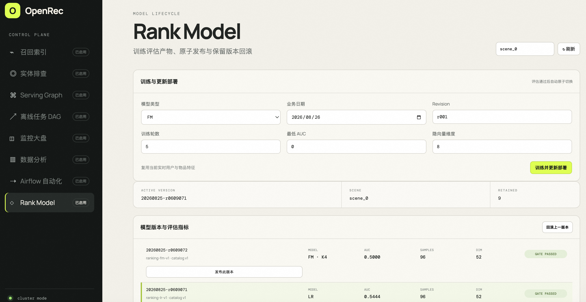 | 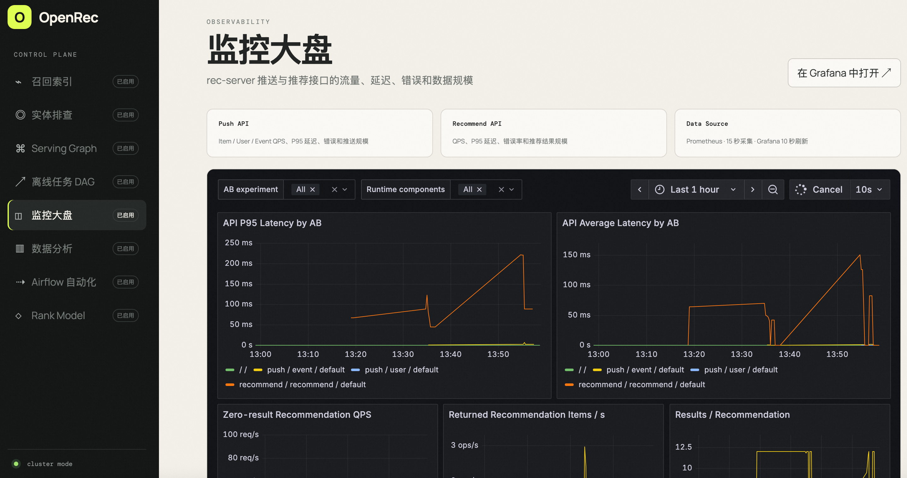 |
| Train LR or FM candidates, enforce evaluation gates, publish an approved model, and roll back to a retained version by scene. | Track push and recommendation QPS, latency, errors, result volume, runtime components, and experiment dimensions in the embedded Grafana view. |

Recall releases, offline workflows, rank-model lifecycle, and full experiment operations are
cluster capabilities. Standalone mode keeps the same Web Demo and provides monitoring, entity
diagnostics, and Serving Graph management for local development and integration testing.

## Product landscape

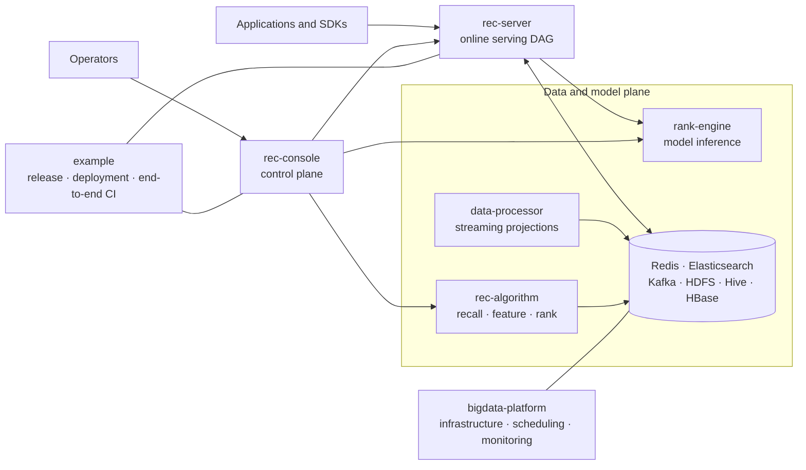

### Recommendation lifecycle

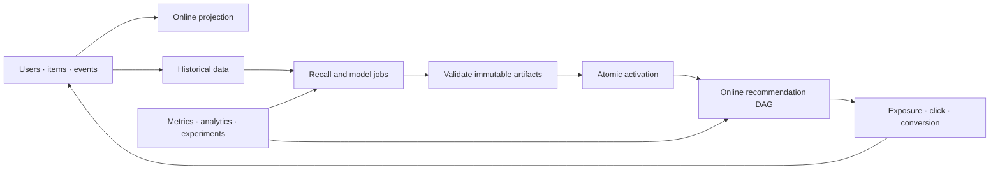

## Deployment modes

| Capability | Standalone | Cluster |
|---|---|---|
| Intended use | Local development and small-to-medium integration | Distributed, production-oriented integration |
| Application API and serving DAG | `rec-server` | The same `rec-server` contract |
| Online state | Redis | Redis projections from Kafka |
| Recall and vector indexes | Elasticsearch | Versioned Elasticsearch indexes and active aliases |
| Ingestion | Direct write | Kafka mutation envelope |
| Processing | Local import and algorithms | Spark/Flink streaming and batch processing |
| Scheduling | Manual/local | Airflow |
| Ranking | Optional bypass | Versioned `rank-engine` models |
| Operations | Monitoring, entities, serving graph | Full workflow, release, analytics, model, and experiment control |
| Observability | Prometheus and Grafana | Prometheus and Grafana plus distributed service metrics |

Both modes use the same sample data, recommendation API, serving graph contract, and Web Demo. The
deployment profile changes the data path rather than the application integration.

## Standalone architecture

Standalone mode is the smallest complete recommendation chain. It is intended for local
development, algorithm verification, and integration testing on one machine.

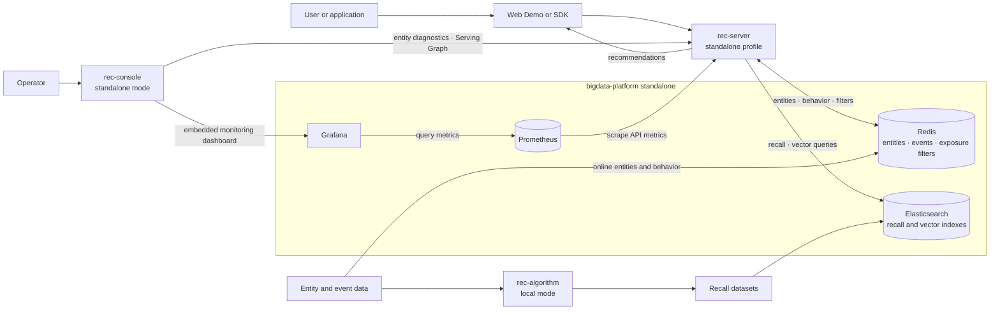

Key characteristics:

- `rec-server` writes pushed data directly to Redis.
- `rec-algorithm` local mode turns entity and event data into recall datasets; the example imports
  source entities and behavior into Redis and recall datasets into Elasticsearch.
- Hot, new, i2i, and embedding recall data are queried from Elasticsearch.
- Redis retains online entities, behavior, blacklist, and exposure-filter state.
- `rec-console` provides monitoring, entity diagnostics, and Serving Graph management. Recall-index
  management, offline DAG, data analysis, Airflow automation, and Rank Model remain visible but are
  disabled as cluster-only modules.
- Prometheus collects rec-server metrics and Grafana provides the dashboard embedded by rec-console.
- Ranking runs in bypass mode; `rank-engine` is not required.
- Kafka, distributed processing, and Airflow are not required.

The internal recall, filtering, combination, and operation flow is defined by the configurable
serving DAG in [rec-server](https://github.com/open-rec/rec-server) and is intentionally omitted
from this deployment-level diagram.

Start the complete standalone example:

```shell
./example/example_standalone/start.sh
```

See the [standalone guide](https://github.com/open-rec/example/tree/master/example_standalone) for
prerequisites, endpoints, smoke verification, and troubleshooting.

## Cluster architecture

Cluster mode is the composition root for the complete recommendation lifecycle. It combines
online serving, real-time ingestion, distributed offline computation, scheduled publishing, model
inference, observability, analytics, and control-plane operations.

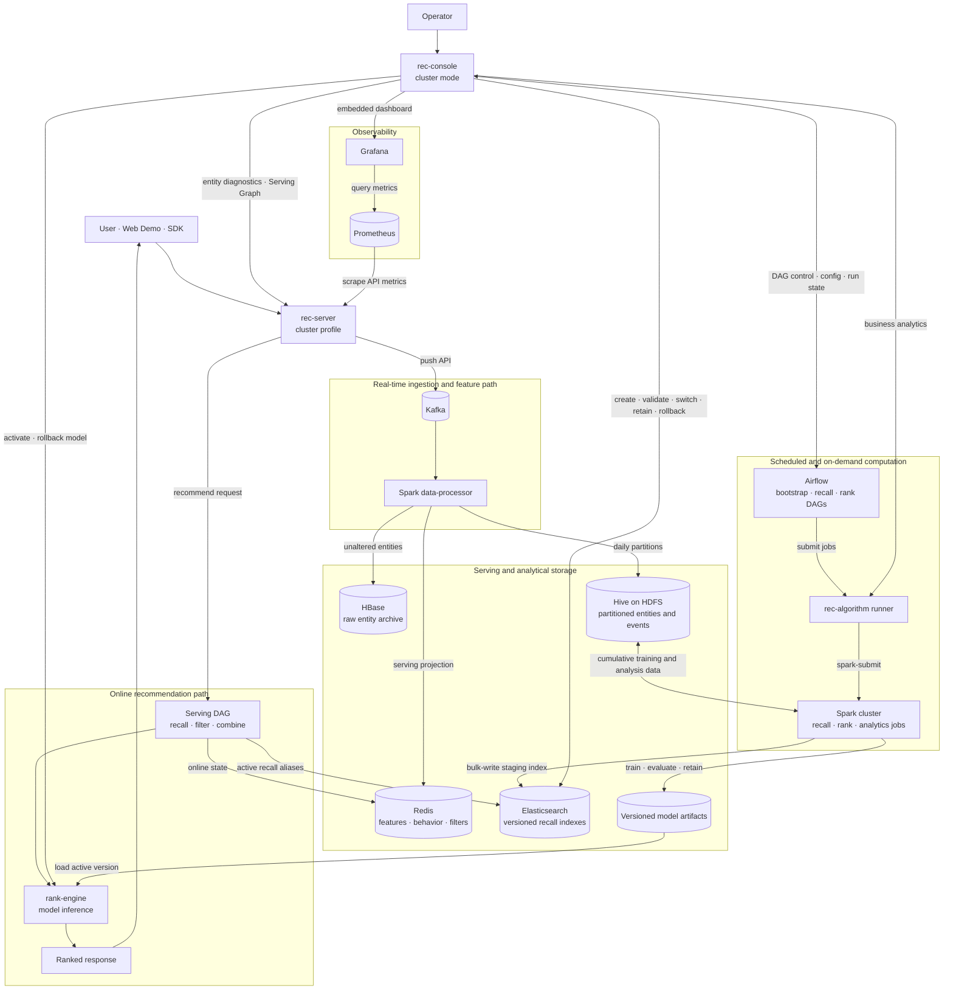

The recall release protocol keeps online serving independent from index deployment:

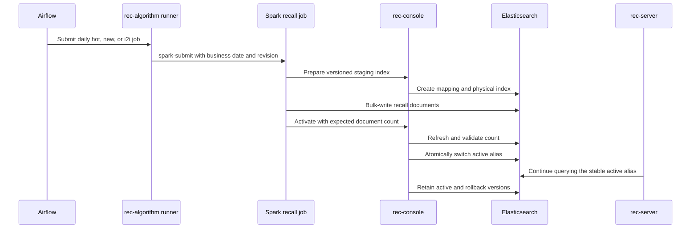

Key characteristics:

- Kafka and the Spark data-processor decouple online pushes from Redis projections, HBase raw
  entity retention, and immutable Hive/HDFS daily partitions.
- Airflow owns bootstrap, recall, rank-training, and rollback orchestration without managing Docker
  containers. The rec-algorithm runner turns those requests into Spark submissions.
- Spark reads cumulative Hive partitions for hot/new/i2i recall, rank training and evaluation, and
  on-demand business analytics.
- `rec-console` manages Airflow, recall-index releases, model activation and rollback, Serving Graph,
  entity diagnostics, analytics, and the embedded monitoring dashboard.
- `rank-engine` loads only evaluated model artifacts activated through rec-console.
- Prometheus collects rec-server API metrics and Grafana supplies the console monitoring dashboard.
- The default recall retention policy keeps the active version plus one rollback version.

Start and verify the complete cluster:

```shell
./example/example_cluster/start.sh
```

Main endpoints after startup:

| Service | Endpoint |
|---|---|
| Web Demo | `http://<host>:12345` |
| rec-server | `http://<host>:13579` |
| rank-engine | `http://<host>:8123` |
| rec-console | `http://<host>:8095` |
| Airflow | `http://<host>:8091` |
| Spark | `http://<host>:8083` |
| Flink | `http://<host>:8087` |

See the [cluster guide](https://github.com/open-rec/example/tree/master/example_cluster) for the
full startup sequence, service ownership, DAG behavior, and troubleshooting.

## Component map

| Repository | Responsibility | Start here when… |
|---|---|---|
| **[example](https://github.com/open-rec/example)** | OpenRec distribution, deployment guides, version manifest, runnable examples, and end-to-end CI | You want to install, evaluate, or release OpenRec |
| **[rec-server](https://github.com/open-rec/rec-server)** | Java online service, recommendation protocol, serving DAG, recall/filter/rank nodes | You are extending online recommendation behavior |
| **[rec-console](https://github.com/open-rec/rec-console)** | Operations UI and APIs for graph, workflow, recall, model, experiment, analytics, and diagnostics | You are operating or governing the platform |
| **[rec-algorithm](https://github.com/open-rec/rec-algorithm)** | Local and Spark recall, embedding, feature, ranking, evaluation, and publication jobs | You are developing offline algorithms |
| **[rank-engine](https://github.com/open-rec/rank-engine)** | Rank-model training/release support and online inference | You are adding or serving ranking models |
| **[data-processor](https://github.com/open-rec/data-processor)** | Kafka mutation processing and Redis/HBase/Hive projections with Spark and Flink | You are changing the real-time data path |
| **[bigdata-platform](https://github.com/open-rec/bigdata-platform)** | Containerized storage, messaging, compute, scheduling, and monitoring infrastructure | You are deploying or debugging dependencies |
| **[sdk](https://github.com/open-rec/sdk)** | Application client SDKs | You are integrating an application |
| **[model](https://github.com/open-rec/model)** | Sample recall datasets, features, and rank artifacts | You need reproducible sample artifacts |

Dependency direction and repository ownership are maintained in the
[distribution architecture](https://github.com/open-rec/example/blob/master/docs/architecture.md).

## Quality and releases

The [example distribution](https://github.com/open-rec/example) is the compatibility authority for
a complete OpenRec version. Its manifest records the component refs used by a release, and its CI
verifies four levels:

1. Repository policy, shell, Python DAG, Compose, and manifest validation.
2. Cross-repository Java compilation and focused unit tests.
3. Standalone startup, sample import, serving-graph execution, and a real recommendation request.
4. Cluster ingestion, streaming projection, Hive persistence, recall publication, model lifecycle,
   analytics, deletion semantics, and online serving.

Component repositories remain independently testable and releasable, while the distribution
defines which versions are known to work together.

## Community

OpenRec welcomes bug reports, documentation improvements, integrations, algorithms, SDKs, and
production feedback.

- Read the [contribution guide](https://github.com/open-rec/.github/blob/master/CONTRIBUTING.md)
  before opening a pull request.
- Use the relevant component repository for scoped bugs and changes; use
  [example issues](https://github.com/open-rec/example/issues) for installation, release, or
  cross-component problems.
- Follow the [Code of Conduct](https://github.com/open-rec/.github/blob/master/CODE_OF_CONDUCT.md).
- Report vulnerabilities privately according to the
  [security policy](https://github.com/open-rec/.github/blob/master/SECURITY.md).
- See [Support](https://github.com/open-rec/.github/blob/master/SUPPORT.md) for help routing and the
  information required for effective diagnosis.

## License

OpenRec components are released under the Apache License 2.0 unless a repository states otherwise.
Third-party services and dependencies retain their respective licenses.
