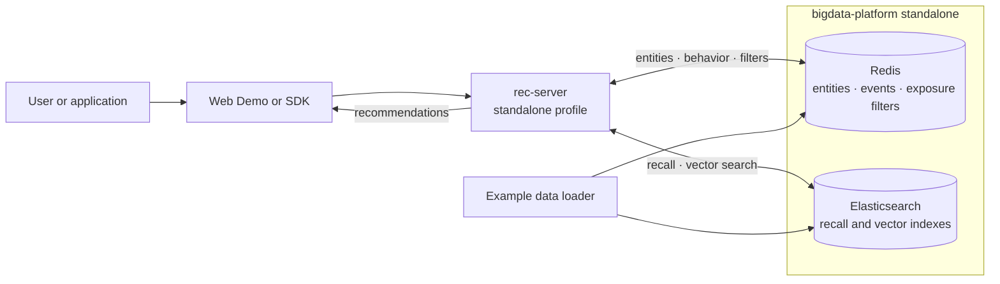
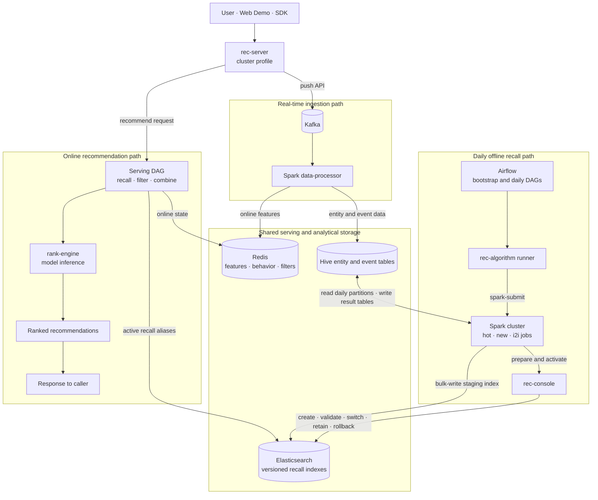
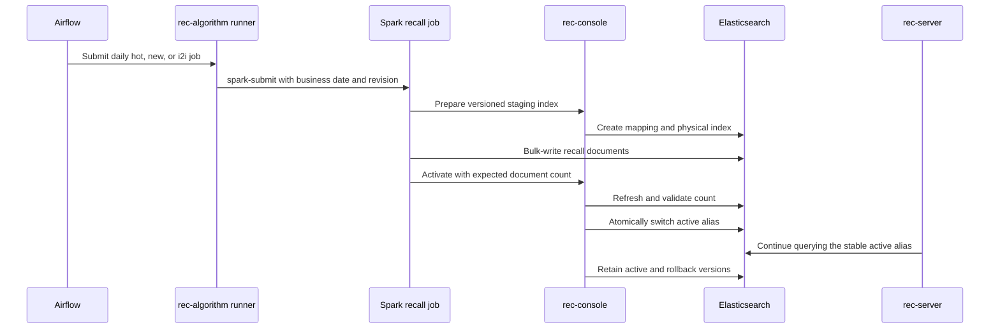

# OpenRec

OpenRec is an open-source recommendation system built around a configurable online serving DAG,
streaming feature pipelines, distributed offline algorithms, and an operational control plane.
It can run as a minimal standalone stack for development or as a complete cluster workflow for
production-oriented integration and scheduling.

## Projects

| Project | Responsibility |
|---|---|
| [rec-server](https://github.com/open-rec/rec-server) | Java online recommendation service and configurable serving DAG |
| [rec-algorithm](https://github.com/open-rec/rec-algorithm) | Spark offline recall, feature, and ranking jobs |
| [rank-engine](https://github.com/open-rec/rank-engine) | Python model inference service |
| [rec-console](https://github.com/open-rec/rec-console) | Recall-index control plane and operations UI |
| [data-processor](https://github.com/open-rec/data-processor) | Kafka streaming pipelines implemented with Spark and Flink |
| [bigdata-platform](https://github.com/open-rec/bigdata-platform) | Reusable storage, messaging, compute, and scheduling infrastructure |
| [example](https://github.com/open-rec/example) | Standalone and cluster composition roots with end-to-end verification |
| [sdk](https://github.com/open-rec/sdk) | Client SDKs for OpenRec services |

## Standalone architecture

Standalone mode is the smallest complete recommendation chain. It is intended for local
development, algorithm verification, and integration testing on one machine.



Key characteristics:

- `rec-server` writes pushed data directly to Redis.
- Hot, new, i2i, and embedding recall data are queried from Elasticsearch.
- Redis retains online entities, behavior, blacklist, and exposure-filter state.
- Ranking runs in bypass mode; `rank-engine` is not required.
- Kafka, distributed processing, Airflow, and `rec-console` are not required.

The internal recall, filtering, combination, and operation flow is defined by the configurable
serving DAG in [rec-server](https://github.com/open-rec/rec-server) and is intentionally omitted
from this deployment-level diagram.

Start the complete standalone example:

```shell
./example/example_standalone/start.sh
```

See the [standalone guide](https://github.com/open-rec/example/tree/master/example_standalone) for
prerequisites, endpoints, smoke verification, and troubleshooting.

## Cluster architecture

Cluster mode is the composition root for the complete recommendation lifecycle. It combines
online serving, real-time ingestion, distributed offline computation, scheduled publishing, model
inference, and recall-index operations.



The recall release protocol keeps online serving independent from index deployment:



Key characteristics:

- Kafka and Spark decouple online push traffic from feature persistence.
- HDFS and Hive provide partitioned source and result tables for offline jobs.
- Airflow owns dependency orchestration and daily scheduling without managing Docker containers.
- `rec-console` owns index creation, validation, activation, retention, explicit switching, and
  emergency rollback; `rec-server` remains read-only and version-agnostic.
- `rank-engine` provides online model inference and can evolve independently from serving DAGs.
- The default recall retention policy keeps the active version plus one rollback version.

Start and verify the complete cluster:

```shell
./example/example_cluster/start.sh
```

Main endpoints after startup:

| Service | Endpoint |
|---|---|
| Web Demo | `http://<host>:12345` |
| rec-server | `http://<host>:13579` |
| rank-engine | `http://<host>:8123` |
| rec-console | `http://<host>:8095` |
| Airflow | `http://<host>:8091` |
| Spark | `http://<host>:8083` |
| Flink | `http://<host>:8087` |

See the [cluster guide](https://github.com/open-rec/example/tree/master/example_cluster) for the
full startup sequence, service ownership, DAG behavior, and troubleshooting.

## Deployment comparison

| Concern | Standalone | Cluster |
|---|---|---|
| Primary use | Local development and smoke testing | Complete distributed integration |
| Infrastructure | Redis and Elasticsearch | Kafka, HDFS, Hive, Spark, Flink, Redis, Elasticsearch, Airflow |
| Push path | `rec-server` writes Redis directly | `rec-server` publishes to Kafka |
| Streaming processor | Not required | Spark data-processor |
| Offline scheduling | Not required | Airflow and Spark recall jobs |
| Recall index control | Example bootstrap data | `rec-console` version lifecycle |
| Ranking | Bypassed | `rank-engine` inference |
| Online recall contract | Elasticsearch aliases and vector indexes | Same online contract |

Both modes use the same `rec-server` image, recommendation DAG, storage contracts, sample data,
and Web Demo. Runtime profiles change deployment behavior without changing the recommendation API.
